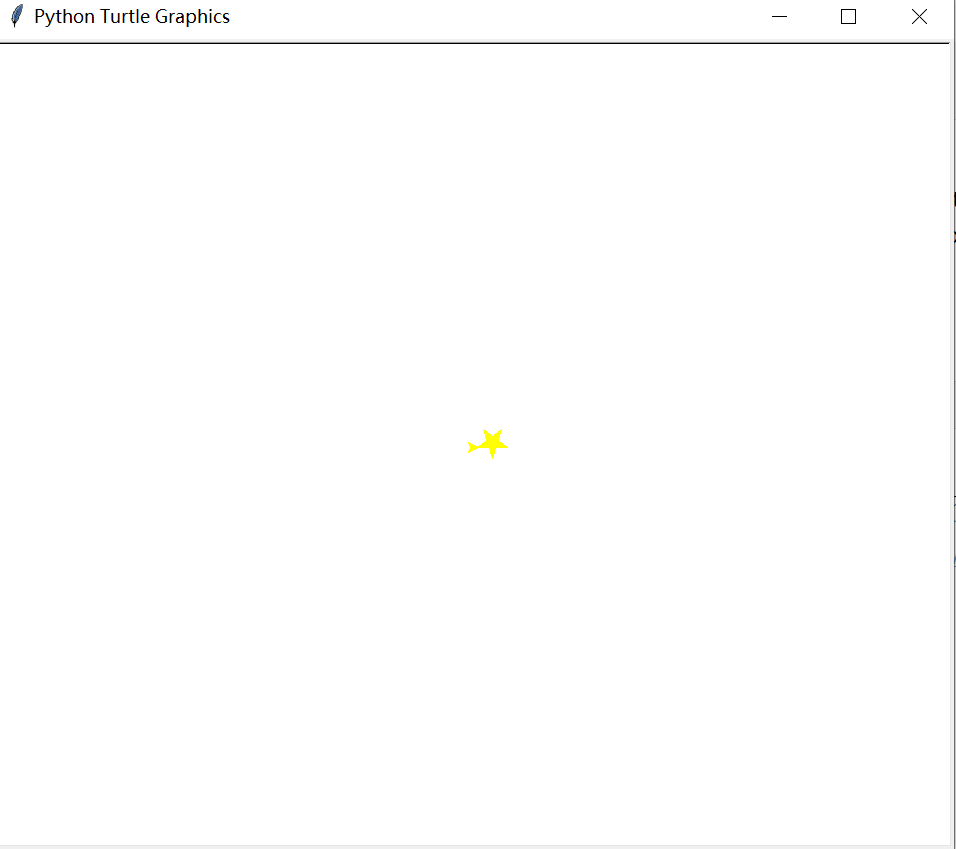
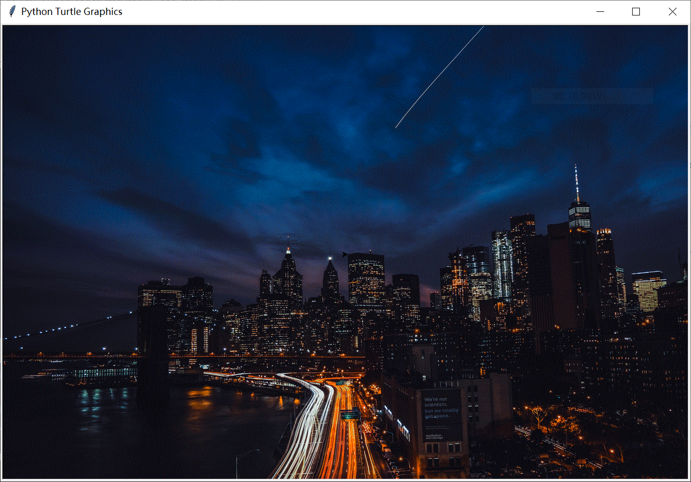

# 设置窗口背景及绘制第一颗星 

## 学了本课，我可以掌握 

* 给窗口设置背景
* 在窗口中绘制一颗五角星

## 知识回顾

%accordion%导入及创建海龟实例%accordion%
```
import turtle
t = turtle.Turtle()
``` 
%/accordion%

%accordion%设置颜色%accordion%
```
t.color("yellow")  # 设置颜色
``` 
%/accordion%


%accordion%填充图形%accordion%
```
t.begin_fill()   # 开始填充
# 绘制的封闭图形
t.end_fill()     # 填充结束
``` 
%/accordion%



复制下面代码到 Thonny 中，保存为 01.py，执行

```python
import turtle

t = turtle.Turtle()  # 创建海龟实例

t.color("yellow")  # 设置颜色

t.begin_fill()   # 开始填充
for i in range(5):
    t.forward(30)
    t.left(144)   # 五角星转动角度
t.end_fill()     # 填充结束

```
   

执行结果如下图：




## 新知识

要想将下面这张图片设置为窗口的背景


则要用到 `turtle.Screen` 这个类中的 `bgpic` 方法，具体用法如下：

```python
import turtle

t = turtle.Turtle()    # 创建海龟实例
wn = turtle.Screen()   # 创建窗口实例

width = 1336
height = 889

wn.setup(width, height)     # 设置窗口大小
wn.bgpic("city-night.gif")  # 设置背景图片
```

这里需要注意：
* 背景图片一定要 `.gif` 格式的。
* 背景图片要与脚本放在相同的文件夹内，否则要指明图片的具体路径。


## 任务一：设置窗口的背景

完成效果如下：



## 任务二 ：绘制一颗五角星


