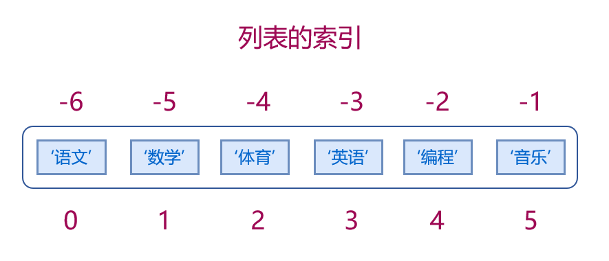

# Python 中的列表

列表可以说是 Python 中最通用、最有用的数据类型。 您几乎可以在每个重要的 Python 程序中找到它们。

在 Python 中，如果说字符串是字符的容器，那么列表则是一个功能更强大的容器。那里面可以包含任意类型的对象。


我们将从 **CRUD** 四个方面来学习列表的知识，CRUD 是四个单词的首字母，它们分别是：

* 创建（Create）
* 读取（Read）
* 更新（Update）
* 删除（Delete）


## 列表的创建（Create）

### 使用 `[]` 创建

定义列表可以使用方括号 `[]`，元素之间用英文逗号分隔 `, `。

```python
# 空列表 
xs = []

# 只包含整数的列表
nums = [1, 2, 5, 9, 0]

# 只包含字符串的列表
chars = ['ab', 'bc', 'c', 'def']

# 包含多种类型数据的列表
chars = [8, 3.14, 'abc', [1, 2, 3], ('c', 'd'), True]
```

列表还可以嵌套，即列表中还可以包含列表，且没有层级的限制。

```python
xs = [1, [21, 22], 3, [41, 42, 43], 5]

xs = [1, [2, 3], 4, [5, 6, [7, 8, 9], 10], 11]
```

### 使用构造器 `list()` 创建

```python
# 创建一个空列表
xs = list()

# 将字符串转换为列表
chars = list('Hello')
# ['H', 'e', 'l', 'l', 'o']

```

### 将字符串拆分为列表

```python
s = "A apple a day keep doctor away"
words = s.split()
print(words)
# ['A', 'apple', 'a', 'day', 'keep', 'doctor', 'away']
```

> [!NOTE|style:flat]
> * 列表是有序的，它的顺序就是定义列表时的顺序。两个列表即使元素相同，如果顺序不同，那它们就不是同一个对象。
> * 列表中可以包含任意对象，可以是同一类型的数据，也可以是任意多种类型。
> * 列表可以包含任意数量的对象，可以是 0 个（空列表），也可以是没有限制的，只要计算机内存允许。
> * 列表内的元素也可以是重复的，而且可以重复任意次。


```python
# 列表是有序的
>>> a = ['a', 'b', 'c', 'd']
>>> b = ['c', 'a', 'b', 'd']
>>> a == b
False
>>> a is b
False

# 列表可以包含任意对象
# 列表的元素可以是同一类型的数据：
xs = [1, 2, 3, 4]
xs = ['a', 'b', 'c', 'd']

# 列表元素可以是任意类型的```python
xs = [5, 3.14, 'abc', True, [1, 2, 3], ('Bob', 34)]

# 列表可以包含任意数量的对象
# 空列表
a = []
# 1 个元素
a = ['abc']
# 很多很多元素
a = [1, 2, 3,..., 1000]

# 次数可以重复，位置可以随意
a = [1, 1, 1, 3, 4, 5, 1, 3]
a = ['red', 'green', 'red', 'blue', 'blue', 'red']
```

## 常用操作

### 列表操作符

#### `+` 合并列表

```python
>>> [1, 2, 3] + [4, 5, 6]
[1, 2, 3, 4, 5, 6]
>>> ['a', 'b'] + ['c', 'd']
['a', 'b', 'c', 'd']
```

#### `*` 重复列表元素

```python
>>> [1, 2, 3] * 2
[1, 2, 3, 1, 2, 3]
>>> ['a', 'b', '#'] * 2
['a', 'b', '#', 'a', 'b', '#']
```

#### 成员判断：`in` 与 `not in`

```python
>>> 4 in [1, 2, 3, 4]
True
>>> 4 not in [1, 2, 3, 4]
False

>>> 'a' in ['a', 'b', 'c']
True
>>> 'a' not in ['a', 'b', 'c']
False
```

### 列表常用函数

```python
>>> xs = [1, 2, 3, 4]
>>> len(xs)  # 列表长度
4
>>> min(xs)  # 列表中最小值
1
>>> max(xs)  # 列表中最大值
4
>>> sum(xs)  # 对列表求和
10
```


### 列表的排序

我们经常会按照某种方式对列表进行排序，可以使用列表的 `sort()` 方法，也可以使用 Python 内置的 `sorted()` 方法。

#### 使用 `sort()` 方法

```python
xs = [1, 4, 3, 2, 9, 7, 6]
print(xs)  # [1, 4, 3, 2, 9, 7, 6]
xs.sort()
print(xs)  # [1, 2, 3, 4, 6, 7, 9]
xs.sort(reverse=True)
print(xs)  # [9, 7, 6, 4, 3, 2, 1]

xs = ['a', 'd', 'b', 'e', 'c']
print(xs)  # ['a', 'd', 'b', 'e', 'c']
xs.sort()
print(xs)  # ['a', 'b', 'c', 'd', 'e']
xs.sort(reverse=True)
print(xs)  # ['e', 'd', 'c', 'b', 'a']
```

#### 使用 `sorted()` 方法

```python
xs = [1, 4, 3, 2, 9, 7, 6]
print(xs)  # [1, 4, 3, 2, 9, 7, 6]
xs1 = sorted(xs)
print(xs1)  # [1, 2, 3, 4, 6, 7, 9]
print(xs)  # [1, 4, 3, 2, 9, 7, 6]
xs2 = sorted(xs, reverse=True)
print(xs2)  # [9, 7, 6, 4, 3, 2, 1]
```

> [!NOTE|style=flat]
> 需要注意的是，列表的 `sort()` 方法是直接修改列表本身，也叫 **原地排序**，它返回的是 `None`
* 而 `sorted()` 方法并不会修改原列表，它会返回一个原列表排序后新的列表

## 列表的读取（Read）

列表元素可以通过 **索引** 获取

### 读取单个元素

要获取列表中的单个元素，可以使用 `[元素索引]` 来获取。

> [!TIP|style:flat]
> 列表的索引，与前面学习过的字符串的索引是一样的用法。
> 索引也是从 `0` 开始的。

来看下面这样一个列表：

```python
courses = ['语文', '数学', '体育', '英语', '编程', '音乐']
```

列表的索引如下图：



要获取列表 *courses* 中的元素，可以这样做：

```python
courses = ['语文', '数学', '体育', '英语', '编程', '音乐']

# 正向索引
print(courses[0]) # 语文
print(courses[2]) # 体育
print(courses[5]) # 音乐

# 负向索引
print(courses[-1]) # 音乐
print(courses[-2]) # 编程
print(courses[-6]) # 语文
```

### 获取多个元素

要从列表中获取多个连续的元素，可以使用 **列表切片**

> [!NOTE|style:flat]
> `a[m:n]` 返回索引为 `m` 到 `n` 的元素，但不包括索引为 `n` 的元素

```python
# 正索引切片
>>> courses[1:4]
['数学', '体育', '英语']

# 负索引切片
>>> courses[-5:-2]
['数学', '体育', '英语']

# 省略开始索引
>>> courses[:3]
['语文', '数学', '体育']
>>> courses[:-2]
['语文', '数学', '体育', '英语']


# 省略结束索引
>>> courses[3:]
['英语', '编程', '音乐']
>>> courses[-3:]
['英语', '编程', '音乐']

# 同时省略开始结束索引
>>> courses[::-1]
['音乐', '编程', '英语', '体育', '数学', '语文']


# 使用步长 
>>> courses[0:6:2]
['语文', '体育', '编程']
>>> courses[1:6:2]
['数学', '英语', '音乐']
>>> courses[-1:0:-2]
['音乐', '英语', '数学']
```

> [!TIP|style:flat]
> 要想让列表的元素颠倒顺序，方法很简单，使用 `列表[::-1]` 即可

```python
# 逆序 
>>> courses[::-1]
['音乐', '编程', '英语', '体育', '数学', '语文']
```

### 获取嵌套列表（多级列表）的元素

对于多级列表元素的获取，方法还是一样，继续使用 **索引**。

假设有这个一个列表：

```python
xs = ['a', ['bb', 'cc'], 'd', ['ee', ['fff', 'ggg'], 'hh'], 'i']
```

不难发现 `xs[0]`, `xs[2]`, `xs[-1]` 都是字符串，每个元素长度为 1

```python
print(xs[0], xs[2], xs[-1])
# a d i
```

但 `xs[1]`, `xs[3]` 却是子列表：

```python
>>> xs[1]
['bb', 'cc']
>>> xs[3]
['ee', ['fff', 'ggg'], 'hh']
```

如果要获取子列表中的元素，只要在后面添加额外的索引

```python
>>> xs[1]
['bb', 'cc']
>>> xs[1][0]
'bb'
>>> xs[1][1]
'cc'
>>> xs[3]
['ee', ['fff', 'ggg'], 'hh']
>>> xs[3][0]
'ee'
>>> xs[3][1]
['fff', 'ggg']
>>> xs[3][1][0]
'fff'
>>> xs[3][1][1]
'ggg'
```

## 列表的更新修改（Update）

在前面的学习中，我们了解到字符串是不可以修改的。我们没有办法修改给定字符串里面的某个或多个字符，只能重新创建新的字符。

而列表却是 **可变的**，可以很容易地修改它的元素。

### 向列表中添加元素

* 添加到列表最后 `.append()`

```python
>>> xs = [1, 2, 3, 4, 5]
>>> xs
[1, 2, 3, 4, 5]
>>> xs.append(6)
>>> xs
[1, 2, 3, 4, 5, 6]
>>> xs.append(7)
>>> xs
[1, 2, 3, 4, 5, 6, 7]
```

* 添加到列表指定索引位置 `.insert()`

```python
>>> xs = [1, 2, 3, 4, 5]
>>> xs
[1, 2, 3, 4, 5]
>>> xs.insert(0, 10)
>>> xs
[10, 1, 2, 3, 4, 5]
>>> xs.insert(2, 20)
>>> xs
[10, 1, 20, 2, 3, 4, 5]
```


### 合并两个列表

合并两个列表，是将一个列表中所有元素整体添加到另一个列表中。

可以使用 `.extend()` 来实现。

```python
>>> a = [1, 2, 3]
>>> b = [4, 5, 6]
>>> a
[1, 2, 3]
>>> a.extend(b)
>>> a
[1, 2, 3, 4, 5, 6]
```


### 修改单个元素

```python
>>> xs = [1, 2, 3, 4]
>>> xs
[1, 2, 3, 4]
>>> xs[1] = 5
>>> xs
[1, 5, 3, 4]

```

### 修改多个元素

```python
>>> xs[1:3] = [10, 20]
>>> xs
[1, 10, 20, 4]
```

> [!NOTE|style:flat]
> 修改多个元素时，插入的元素数量不必等于替换的数量。 Python 会根据需要增加或缩小列表。


* 可以插入多个元素来代替单个元素——只需使用仅表示一个元素的切片

```python
>>> xs = [1, 2, 3, 4]
>>> xs[1:2] = [5, 5, 5]
>>> xs
[1, 5, 5, 5, 3, 4]
```

* 甚至还可以不替换原有元素，直接添加

```python
>>> xs
[1, 2, 3, 4]
>>> xs [1:1] = [7, 8, 9]
>>> xs
[1, 7, 8, 9, 2, 3, 4]
```


## 列表的删除（Delete）

### 删除列表元素

* 使用 `a.remove(obj)` 命令来删除列表元素

从列表 `a` 中移除第一个值为 `obj` 的元素，若列表中没有这个值，则会抛出异常错误。

```python
>>> a = [1, 2, 3, 2, 4, 5]
>>> a.remove(2)
>>> a
[1, 3, 2, 4, 5]
>>> a.remove(3)
>>> a
[1, 2, 4, 5]
>>> a.remove(3)
Traceback (most recent call last):
  File "<pyshell>", line 1, in <module>
ValueError: list.remove(x): x not in list
```

* 使用 `a.pop(index=-1)` 命令来删除列表元素

从列表中移除指定索引位置的元素，并返回该元素。默认索引为 `-1` ，即移除列表最后的元素。

```python
>>> a = [1, 2, 3, 4, 5]
>>> a.pop()
5
>>> a
[1, 2, 3, 4]
>>> a.pop(1)
2
>>> a
[1, 3, 4]
>>> a.pop(-2)
3
>>> a
[1, 4]
```

> [!NOTE|style:flat]
> * 要注意 `remove` 与 `pop` 之间的区别
>   * `remove` 里要指明删除的元素，而 `pop` 则要指明元素的索引
>   * `remove` 只是将元素删除，不会返回值；而 `pop` 则会将元素删除，并将该元素返回


* 使用 `del` 命令来删除列表元素

```python
>>> xs
[1, 5, 5, 5, 3, 4]
>>> del xs[0]
>>> xs
[5, 5, 5, 3, 4]
>>> del xs[-1]
>>> xs
[5, 5, 5, 3]
```

* 使用切片赋空列表的方式来删除列表元素

```python
>>> xs = [1, 2, 3, 4, 5]
>>> xs[1:4]
[2, 3, 4]
>>> xs[1:4] = []
>>> xs
[1, 5]
```

### 删除列表

```python
>>> xs = [1, 2, 3, 4, 5]
>>> xs
[1, 2, 3, 4, 5]
>>> del xs
>>> xs
Traceback (most recent call last):
  File "<pyshell>", line 1, in <module>
NameError: name 'xs' is not defined
```

## 列表的理解

列表的理解，其实对初学者并不太好理解，但很好用，也相对高效，值得我们花时间去学习掌握。

### 列表理解的语法

语法其实很简单

```python

```


## 总结

* 主要讲了列表的 **CRUD**，可根据这个框架来进行复习
* 列表的三个操作符： `+`, `*`, `in`
* 列表常用函数：
    * `len()`
    * `min()`
    * `max()`
    * `sum()`
* 列表的排序