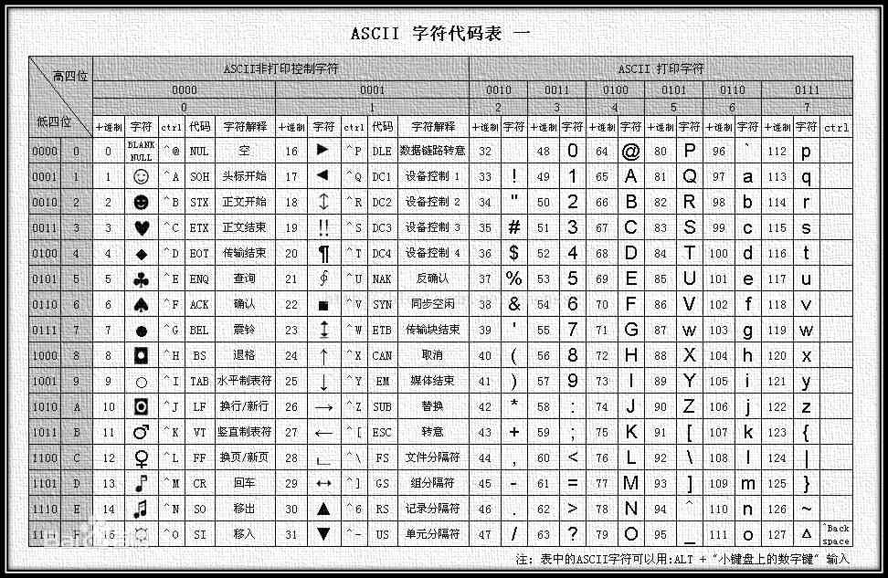
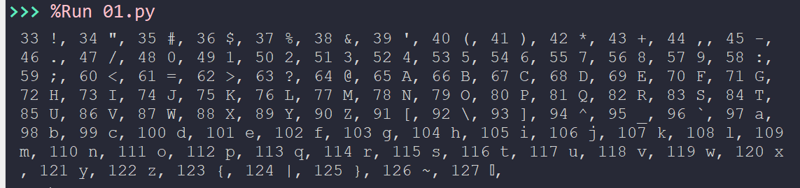
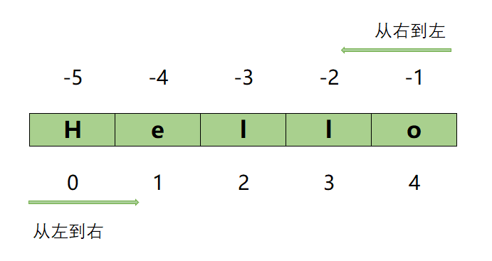

 Python 的基本数据类型——String（字符串）

## 学了本课，可以掌握 

* 字符串的定义及作用 
* 字符串的定义及作用 


## 字符串的定义

> [!NOTE|style:flat]
> 字符串(string) 是 Python 的一种基本对象，它是包含各种字符数据的序列。

如果说一个程序不处理字符数据，这几乎是不可能的。

### 字符串的定义

字符串，在单引号、双引号或三引号之间的内容全部为字符串的组成。

```python
s1 = '我是字符串'
s2 = "我也是字符串"
s3 = """
我还是字符串
而且，我还可以多行
"""
```

> [!DANGER|style:flat]
> 需要注意这里的引号是英文状态下，若是中文引号，则会报错

```python
s1 = '我是字符串‘
  File "<pyshell>", line 1
    s1 = '我是字符串‘
               ^
SyntaxError: EOL while scanning string literal
```

字符串中的字符数量没有限制，取决你机器的内存。字符串也可以为空字符串：

```python
s = ''
`` 进行转换时，参数要求为整数，需要将输入的数字转换为整数，可以使用 `int()``

### 字符串中要包含引号

如果要在字符串中包含引号，有两种方法：

```python
# 1. 里面错开
s = '培根说过："知识就是力量"'
s = "Someone said, 'you can you up, no can no bb'."

# 2. 使用转义字符
s = "培根说过：\"知识就是力量\""
s = 'Someone said, \'you can you up, no can no bb\'.'
```

### 转义字符

常见转义字符有：

|转义字符|含义|
|----|----|
|`\'`|`'`|
|`\"`|`"`|
|`\\`|`\`|
|`\n`|换行符|
|`\t`|制表符（相当于按一下 Tab 键） |


举例如下：

```python
print("a\tb")
a    b
print("a\nb")
a
b
```

### 任务一：练习示例

下面哪些表达式是表示 `abc'def` 的有效方法？

* A. 'abc'def'
* B. "abc'def"
* C. 'abc\'def'
* D. """abc'def"""
* E. 'abc''def'


### 原始字符串

原始字符串字面量以 `r` 或 `R` 开头，它不翻译字符串中的转义序列。

```python
print('foo\nbar')
foo
bar
print(r'foo\nbar')
foo\nbar

print('foo\\bar')
foo\bar
print(R'foo\\bar')
foo\\bar
```


## 操作字符串

字符串有许多特有的操作符、方法与函数。

### 字符串的操作符

#### `+` 操作符

对于字符串来说，`+` 用于 **连接字符串**

```python
s = 'abc'
t = 'uvw'
s + t
'abcuvw'
'2021' + '年' + '12' + '月' + '08' + '日'
'2021年12月08日'
```


#### `*` 操作符

`*` 用于 **创建给定字符串的多个拷贝**

```python
s = '镇海加油！'
s * 5
'镇海加油！镇海加油！镇海加油！镇海加油！镇海加油！'
5 * s
'镇海加油！镇海加油！镇海加油！镇海加油！镇海加油！'
```

> [!TIP|style:flat]
> 试一下，如果将上面的数字换成 **负数** 或者 **小数** 会怎么样？


#### `in` 操作符

`in` 也叫 **成员判断符**，用于 **判断字符串是否存在另一个字符串里面**，如果在，返回 `True`，否则，返回 `False`。

```python
s = '中国宁波镇海'
'镇海' in s
True
'海曙' in s
False
```

还有一个 `not in` 操作符，用于 **判断字符串是否不存在另一个字符串里面**。

```python
'a' not in 'abc'
False
'x' not in 'abc'
True
```


### 内置字符串函数

|函数名称|描述|
|----|----|
|`str()`|返回指定对象的字符串表示|
|`chr()`|将给定整数转换为字符|
|`ord()`|将字符转为整数|
|`len()`|返回字符串的长度|

```python
# str()
str('a')
'a'
str(34)
'34'
str([1, 2, 3])
'[1, 2, 3]'
str({'a': 1, 'b': 2})
"{'a': 1, 'b': 2}"
str(3.14)
'3.14'

# ord() vs chr()
ord('a')
97
ord('z')
122
chr(97)
'a'
chr(122)
'z'

# len()
s = "人生苦短， 我用 Python"
len(s)
15
s = 'Life is short, You need Python.'
len(s)
31

```

### 任务二：打印 ASCII 码

ASCII 码表



#### 1. 打印出 ASCII 码表中可以打印的字符

打印效果如下：



#### 2. 实现一个 ASCII 码转换的程序 

接受用户输入的一个字符、ASCII 码，输出对应的 ASCII 码及对应的字符。

实现效果如下：

```python
%Run 01.py
请输入一个字符：w
请输入一个 ASCII 码：120

w 对应的 ASCII 码为 119
120 对应的字符为 x
```

> [!TIP|style:flat]
> 使用 `chr()` 进行转换时，参数要求为整数，需要将输入的数字转换为整数，可以使用 `int()` 


### 字符串索引

在军训或体育课上，大家站成一排，你肯定报过数。
字符串可以认为是一串字符站成一队排好队，那它们是怎样报数呢？

这个数字就叫字母的 **索引**：
* 从左边开始：从 `0` 开始，接着 `1`, `2`...
* 从右边开始：从 `-1` 开始，接着 `-2`, `-3`...




```python
>>> s = "Hello"
>>> s[0]
'H'
>>> s[1]
'e'
>>> s[4]
'o'
>>> s[-1]
'o'
>>> s[-4]
'e'
>>> s[-5]
'H'
>>> s[len(s) - 1]
'o'
```

如果索引超出长度，则会报错：

```python
>>> s = "Hello"
>>> s[5]
Traceback (most recent call last):
  File "<pyshell>", line 1, in <module>
IndexError: string index out of range
>>> s[-6]
Traceback (most recent call last):
  File "<pyshell>", line 1, in <module>
IndexError: string index out of range
```

### 字符串切片

前面我们通过 **索引** 可以获取单个的指定位置的字符，那如果想获取 **子字符串** （也就是原字符串的一部分） 呢？

#### 切片语法

可以通过一种叫做 **切片** 的语法来获取。
具体语法为

```python
s[start:end:step]
```

表示获取 s 字符串的子字符串，从索引 `start` 开始到 `end` 结束，但不包括 `end` 位置的字符。`step`叫 **步长**，表示每次变大变小几个。


#### 举例

```python
>>> s
'Hello'
>>> s[0:3]
'Hel'
>>> s[2:5]
'llo'

# 也可以用负索引
>>> s[-4:-1]
'ell'
>>> s[-5:-2]
'Hel'
```

#### 省略开始或结束索引

```python
>>> s
'Hello'

# 省略开始索引
>>> s[:3]
'Hel'
>>> s[:5]
'Hello'

# 省略结束索引
>>> s[0:]
'Hello'
>>> s[3:]
'lo'

# 开始与结束索引全都省略，得到原字符串的副本
>>> s[:]
'Hello'
```

#### 练习：

有一段在 Python Shell 中执行的测试代码，有一部分内容缺失了，不运行代码，思考 `s[:n] + s[n:] = ` ？之后再通过代码来验证。

```python
>>> s = "Hello"
>>> t = s[:]
>>> t
        # 输出 1
>>> id(s)
        # 输出 2
>>> id(t)
        # 输出 3
>>> s is t
        # 输出 4 
```

#### 加上步长

```python
>>> s
'Hello'
>>> s[:5:2]
'Hlo'
>>> s[0:5:3]
'Hl'

>>> s = 'abc' * 5
>>> s
'abcabcabcabcabc'
>>> s[::3]
'aaaaa'
>>> s[-1::-3]
'ccccc'
```

#### 字符串倒序

Python 提供了一个很方便好用的获取字符串倒序（逆序）的方法。

```python
>>> s = 'Hello'
>>> s
'Hello'
>>> s[::-1]
'olleH'
```


### 将变量插入到字符串中

可以通过 `f-string` (f-字符串) 来很方便地将 **变量** 插入到字符串中。

所谓 `f-string` 就是字符串的左引号的左边用 `f` 或 `F` 开头，变量用 `{}` 括起来。

```python
# 直接使用变量
>>> a = 3
>>> b = 5
>>> result = a + b
>>> print(f"{a} + {b} = {result}")
3 + 5 = 8

# 进行计算
>>> print(f"{a} + {b} = {a + b}")
3 + 5 = 8

# 调用函数
>>> x = -3
>>> print(f"{x} 的绝对值为: {abs(x)}")
-3 的绝对值为: 3
>>> s = 'python'
>>> print(f"{s} 的大写为：{s.upper()}")
python 的大写为：PYTHON
```

f-string 还有许多有趣的用法，留待聪明的你去挖掘了。


#### 练习：有两个变量 `name` 与 `age` 

用 `f-string` 写一个描述性的语句，将上述变量包含在里面.

### 修改字符串

比如，想将字符串 `python` 修改为 `Python`，应该是这样做：

```python
>>> s
'python'
>>> s[0] = 'P'
Traceback (most recent call last):
  File "<pyshell>", line 1, in <module>
TypeError: 'str' object does not support item assignment
```

这里为什么会报错，因为 **字符串是一种不可修改的数据类型**。

那怎么实现上面的任务呢？ **重新创建一个字符串**

```python
>>> s
'python'
>>> new_s = 'P' + s[1:]
>>> new_s
'Python'
```


## 字符串内置方法

在 Python 中，字符串有许多内置的方法，可以通过 `dir('abc')` 来查看，而具体方法的用法，可以通过 `help()` 来获取。

```python
>>> dir('abc')
['__add__', '__class__', '__contains__', '__delattr__', '__dir__', '__doc__', '__eq__', '__format__', '__ge__', '__getattribute__', '__getitem__', '__getnewargs__', '__gt__', '__hash__', '__init__', '__init_subclass__', '__iter__', '__le__', '__len__', '__lt__', '__mod__', '__mul__', '__ne__', '__new__', '__reduce__', '__reduce_ex__', '__repr__', '__rmod__', '__rmul__', '__setattr__', '__sizeof__', '__str__', '__subclasshook__', 'capitalize', 'casefold', 'center', 'count', 'encode', 'endswith', 'expandtabs', 'find', 'format', 'format_map', 'index', 'isalnum', 'isalpha', 'isascii', 'isdecimal', 'isdigit', 'isidentifier', 'islower', 'isnumeric', 'isprintable', 'isspace', 'istitle', 'isupper', 'join', 'ljust', 'lower', 'lstrip', 'maketrans', 'partition', 'replace', 'rfind', 'rindex', 'rjust', 'rpartition', 'rsplit', 'rstrip', 'split', 'splitlines', 'startswith', 'strip', 'swapcase', 'title', 'translate', 'upper', 'zfill']

>>> help('abc'.upper)
Help on built-in function upper:

upper() method of builtins.str instance
    Return a copy of the string converted to uppercase.

# 字符串方法用法举例
# 返回给定字符串大写形式
>>> 'abc'.upper()
'ABC'
```

### 常用字符串内置方法

#### 大小写转换

**对目标字符串执行大小写转换**

|方法|描述|举例|
|----|----|----|
|`s.capitalize()`|返回首字母大写的字符串副本|`'hello python'.capitalize()` <br /> `# Hello python`|
|`s.lower()`|返回小写的字符串副本|`'Hello PYTHON'.lower()` <br /> `# hello python`|
|`s.swapcase()`|返回大小写互换的字符串副本|`'Hello Python'.swapcase()` <br /> `# hELLO pYTHON`|
|`s.title()`|返回每个单词首字母大写的字符串副本|`'hello python'.title()` <br /> `# Hello Python`|
|`s.upper()`|返回全大写的字符串副本|`'hello python'.upper()` <br /> `# HELLO PYTHON`|

#### 查找与替换

**主要是在目标字符串中搜索指定子字符串的各种方法**

|方法|描述|举例|
|----|----|----|
|`s.count()`|统计子字符串在目标字符串中出现的次数|`'abc bbc cbc'.count('bc')` <br /> `# 3` <br />`'abc bbc cbc'.count('bc', 0, 7)` <br /> `# 2`|
|`s.startswith()`|判断目标字符串是否以给定字符串开头|`'abc bbc'.starswith('ab')` <br /> `# True`|
|`s.endswith()`|判断目标字符串是否以给定字符串结尾|`'abc bbc'.endswith('ab')` <br /> `# False`|
|`s.find()`|在目标字符串中查找给定的子字符串开始的索引值 <br />如果没有找到，返回 `-1`|`'Hello Python'.find('llo')` <br /> `# 2`|
|`s.index()`|返回子字符串在目标字符串中出现的索引值 <br />如果没有，抛出 `ValueError` 错误|`'abc bbc cbc'.index('bc')` <br /> `# 1`|
|`s.rfind()`|在目标字符串中从右边开始查找给定的子字符串开始的索引值 <br />如果没有找到，返回 `-1`|`'abc bbc cbc'.rfind('cb')` <br /> `# 8`|
|`s.rindex()`|返回子字符串在目标字符串中从右边算起出现的索引值 <br />如果没有，抛出 `ValueError` 错误|`'abc bbc cbc'.rindex('bc')` <br /> `# 9`|
|`s.replace()`|在目标字符串中将指定的子字符串替换为新的子字符串|`'abc bbc cbc'.replace('bc', '@@')` <br /> `# a@@ b@@ c@@`|
|`s.strip()`|从字符串的左右两端去除字符，默认去掉空白字符<br />可以是空格、制表符、换行符|`'  abc bbc cbc \t'.strip()` <br /> `# 'abc bbc cbc'`|


**练习**

不执行代码，思考一下打印的内容：

```python
print(
    '$100 $200 $300'.count('$'),
    '$100 $200 $300'.count('$', 5, 10),
    '$100 $200 $300'.count('$', 5)
)
```


#### 字符分类 

**根据字符串包含的字符对字符串进行分类**

|方法|描述|举例|
|----|----|----|
|`s.isalnum()`|判断目标字符串所包含字符是否全为字符或数字组成<br />若全为字符或数字，返回 `True`；否则返回 `False` |`'abc123'.isalnum()` <br /> `# True`<br />`'abc123@qq.com'.isalnum()`<br />`# False`|
|`s.isalpha()`|判断目标字符串所包含字符是否全为字母<br />若全为字符，返回 `True`；否则返回 `False` |`'abc123'.isalpha()` <br /> `# False`<br />`'abcABC'.isalpha()`<br />`# True`|
|`s.isdigit()`|判断目标字符串所包含字符是否全为数字<br />若全为数字，返回 `True`；否则返回 `False` |`'12365'.isdigit()` <br /> `# True`<br />`'abc123'.isdigit()`<br />`# False`|
|`s.islower()`|判断目标字符串所包含字母是否全为小写字母<br />若字母全为小写字母，返回 `True`；否则返回 `False` |`'abc#@123def'.islower()` <br /> `# True`<br />`'abc#123Def'.isupper()`<br />`# False`|
|`s.isupper()`|判断目标字符串所包含字母是否全为大写字母<br />若字母全为大写字母，返回 `True`；否则返回 `False` |`'abc#@123def'.isupper()` <br /> `# False`<br />`'ABC#123DEF'.isupper()`<br />`# True`|


#### 字符串格式化 

|方法|描述|举例|
|----|----|----|
|`s.zfill()`|在字符串左边填充 `0`|`'15'.zfill(4)` <br /> `# '0015'`|
|`s.center()`|将字符串在给定的宽度内居中|`'wow'.center(8)` <br /> `# '  wow   '`<br />`'wow'.center(8, '-')` <br />`# '--wow---'`|
|`s.expandtabs(tabsize=8)`|在字符串中扩展制表符|`'a\tb\tc'.expandtabs()` <br /> `# 'a       b       c'`<br />`'a\t\b\tc'.expandtabs(tabsize=4)` <br />`# 'a   b   c'`|


#### 字符串与列表转换 

|方法|描述|举例|
|----|----|----|
|`s.join()`|将给定迭代器中元素连接为字符串|`''.join([1, 2, 3, 4])` <br /> `# '1234'`<br />`'#'.join(['a', 'b', 'c'])` <br />`# 'a#b#c'`|
|`list('abcd')`|将字符串转换为字母列表|`list('abcd')` <br /> `# ['a', 'b', 'c', 'd']`|
|`s.partition()`|将目标字符串根据分隔符进行拆分<br />返回一个 **元组**|`'name@qq.com'.partition('@')` <br /> `# ('name', '@', 'qq.com')`|
|`s.split()`|将目标字符串根据分隔符进行拆分<br />返回一个 **列表**，且不包含分隔符|`'name@qq.com'.split('@')` <br /> `# ['name', 'qq.com']`|


**练习**

不执行代码，思考选择答案。
s 的定义为：`s = 'foo-bar-baz'`，下面哪些表达式的值与 s 相等？

* A. `'-'.join(s.partition('-'))`
* B. `'-'.join(s.split('-'))`
* C. `s.center(15)`
* D. `s.strip('-')`
* E. `s.upper().lower()`
