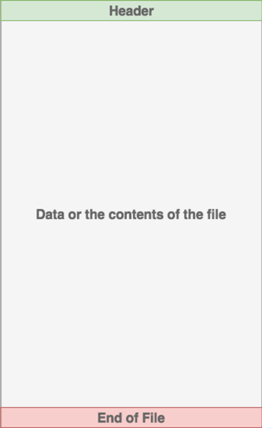
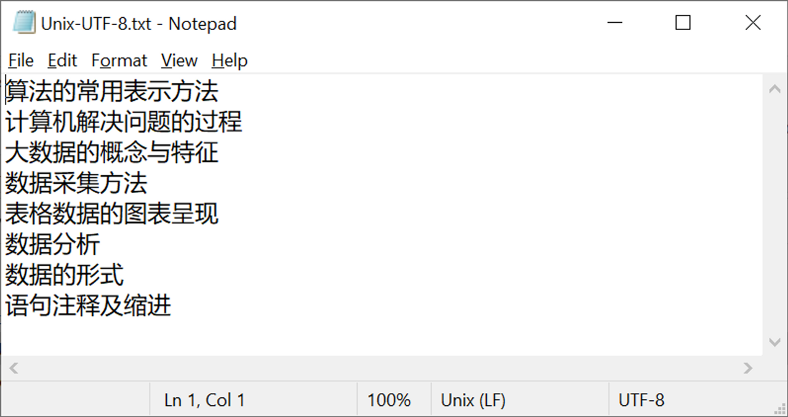
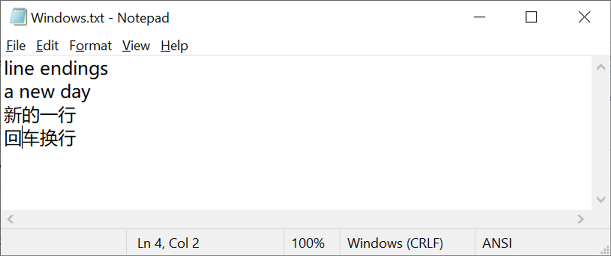

# 文件处理

## 目录


<!-- @import "[TOC]" {cmd="toc" depthFrom=1 depthTo=6 orderedList=false} -->


## 理解文件

### ****什么是文件？****

- 文件的核心是一组用于存储数据的**连续字节**。
- 这些数据**以特定格式组织**
    - 可以是文本文件等简单的文件，也可以是可执行程序等复杂的文件。
- 最后，这些字节文件然后被翻译成二进制文件1，0以便计算机处理。
- 该数据表示的内容取决于所使用的格式规范，通常由**扩展名**表示。

### 文件内容的组成

大多数现代文件系统上的文件由三个主要部分组成：

1. **Header：**
    
    关于文件内容的元数据（文件名、大小、类型等）
    
2. **数据：**
    
    由创建者或编辑者编写的文件内容
    
3. **文件结束 (EOF)：**
    
    表示文件结束的特殊字符

    
    

### 文件扩展名

在 Windows 系统中，数据表示的内容取决于所使用的格式规范，通常由**扩展名**表示。例如，扩展名为 `.gif` 最有可能是符合 *图形交换格式（Graphics Interchange Format）*规范的文件。那里有数百甚至数千个文件扩展名。

### 文件路径

要访问操作系统中的一个文件，文件的路径（file path）则是需要的。

文件路径，就是表示文件位置的字符串。

文件路径通常由三部分组成：

- **文件夹路径（Folder Path）**：文件系统上的文件夹位置，后续文件夹由正斜杠`/`(Unix) 或反斜杠`\`(Windows)分隔
- **文件名（File Name）**：文件的实际名称
- **扩展名（Extension）**：文件路径的末尾以句点 ( `.`) 开头，用于指示文件类型

- 例1：按照路径依次处理
    
    如何访问 cats.gif ？
    
    ```
    /
    │
    ├── foo/   <- 在这里
    |   │
    │   ├── bar/
    │   │   └── cats.gif  <- 访问这个文件
    │   │
    │   └── dog_breeds.txt
    |
    └── animals.csv
    ```
    
    - 答案
        
        > foo/bar/cats.gif
        > 
- 例2：访问当前目录中的文件
    
    如何访问 cats.gif ？
    
    ```
    /
    │
    ├── foo/   
    |   │
    │   ├── bar/    <- 在这里
    │   │   └── cats.gif    <- 访问这个文件
    │   │
    │   └── dog_breeds.txt    
    |
    └── animals.csv
    ```
    
    - 答案
        
        > cats.gif
        > 
        
- 例3：向上访问
    
    如何访问 dog_breeds.txt 与 animals.csv ?
    
    提示：用两个点号 `..` 可以向上移动一个目录
    
    ```
    /
    │
    ├── foo/   
    |   │
    │   ├── bar/             
    │   │   └── cats.gif     <- 在这里
    │   │
    │   └── dog_breeds.txt   <- 访问这个文件
    |
    └── animals.csv         <- 访问这个文件
    ```
    
    - 答案
        
        > ../dog_breeds.txt
        > 
        
        > ../../animals.csv
        > 
        

## 文件处理常见问题

### 行尾（Line Endings）

处理文件数据时经常遇到的一个问题是**新行或行尾的表示**。

Unix 和较新的 Mac 版本仅使用 **LF** 字符，而Windows 使用 **CR+LF** 字符来表示新行 。



Unix(LF)



Windows(CRLF)

### 字符编码（****Character Encodings****）

您可能面临的另一个常见问题是字节数据的编码。

- 编码是从字节数据到人类可读字符的转换。
    - 这通常是通过分配一个数值来表示一个字符来完成的。
    - 两种最常见的编码是 **ASCII** 和 **UNICODE** 格式。
        - ASCII 只能存储 128 个字符
        - 而Unicode 最多可以包含 1,114,112 个字符。
        - ASCII 实际上是[Unicode](https://realpython.com/python-encodings-guide/) (UTF-8) 的子集
            - 这意味着 ASCII 和 Unicode 共享相同的数字到字符值。
    - 请务必注意，使用不正确的字符编码解析文件可能会导致失败或错误表示字符。

## Python 读写文件

### 文件的打开与关闭

在 Python 中可以使用内置的函数 `open()` 来打开文件。

它只需将要打开**文件的路径**作为第一个参数即可。

```python
# 打开文件
file = open('test.txt')
```

要记得，文件在打开处理之后，**务必要记得将文件正确关闭**。

可以使用 `try...finally` 来实现：

```python
file = open('test.txt')
try:
    # 处理
finally:
    file.close()

```

但推荐用更方便的方法 `with` ：

```python
with open('test.txt', 'r') as fh:
    # do some thing
```

`with` 语句，会在代码离开 `with` 语句块之后，将文件 **自动关闭**。

### 打开模式（mode）

在上面语句中 `r` 指代，文件用哪种模式打开，常见模式如下：

| 模式 |  含义 |
| --- | --- |
| r | 只读（默认） |
| w | 可写，会将原有内容覆盖掉 |
| rb  | 以二进制模式打开 |
| wb  | 以二进制模式写 |
| a | 添加到原文件的末尾 |

### 读取文件内容

有多种方法来读取文件

| 方法 | 用途 |
| --- | --- |
| .read(size=-1)  | 从文件中读取 size 字节的内容。如果 size 为 -1 或省略，则读取整个文件。 |
| .readline(size=-1)  | 从文件当前行中读取 size 个字符，一直持续到行尾，然后回绕。如果 size 为 -1 或省略，则读取整个整行。 |
| .readlines()  | 从文件对象中读取 剩余的行，返回行的列表。 |

示例代码

```python
# 读取整个文件
with open('test.txt') as fh:
    data = fh.read()
  
# 从当前行中读取 5 个字节  
with open('test.txt') as fh:   
    tmp = fh.readline(5)
    
# 读取所有行到一个列表
with open('test.txt') as fh:
    lines = fh.readlines()
    # lines = list(fh)
```

### 写内容到文件中

与读取文件一样，文件对象有多种方法可用于写入文件：

| 方法 | 用途 |
| --- | --- |
| .write(string)  | 将字符串写入文件 |
| .writelines(seq)  | 将序列写入文件。但每项的行尾，需要自己添加。 |

示例代码

```python
poem = ['《春晓》', '[唐]孟浩然', '春眠不觉晓，处处闻啼鸟。',
'夜来风雨声，花落知多少。'] 
  
# 写序列  
with open('poem.txt', 'w') as fh:   
    fh.writelines(poem)
    
# 写字符串
with open('poem.txt', 'w') as fh:   
    for line in poem:
        fh.write(line)
```

测试上面代码，打开生成的 `poem.txt` 看一下，有什么问题？思考，如何解决？

### ****遍历文件中的每一行****

在读取文件之后，常做的事情就是遍历每一行。有多种方法来实现：

使用 `.readline()` 迭代实现

```python
with open('poem.txt', 'r') as fh:   
    line = fh.readline()
    while line:
        print(line, end='')
        line = fh.readline()
```

使用 `.readlines()` 返回列表，再处理

```python
with open('poem.txt', 'r') as fh:
    for line in fh.readlines():
        print(line, end='')
```

**直接遍历文件对象**

```python
with open('poem.txt', 'r') as fh:
    for line in fh:
        print(line, end='')
```

最后这种方法更 Pythonic 并且可以更快、更节省内存。因此，建议您改用它。

### 读取字节

对于字节的读取，通常用于处理诸如图片、音频或视频等文件。

比如，可以尝试读取下面这张图片


<!-- @import "[TOC]" {cmd="toc" depthFrom=1 depthTo=6 orderedList=false} -->

将图片保存到脚本所在文件夹，名称为 `bilibili.png`


```python
with open('bilibili.png', 'rb') as fh:
    print(fh.read(8))
# b'\x89PNG\r\n\x1a\n'
```

## 不同的文件用不同的库处理

在用 Python 处理文件时，经常会遇到 `.csv` 及 `.json` 文件，分别有对应的库来处理它们。

```python
import csv
import json
```

除此之外，还有一些常见的文件处理库

- `wave`：读写WAV文件（音频）
- `aifc`： 读写 AIFF 和 AIFC 文件（音频）
- `sunau`： 读写 Sun AU 文件
- `tarfile`： 读写 tar 归档文件
- `zipfile`： 使用 ZIP 档案
- `configparser`：轻松创建和解析配置文件
- `xml.etree.ElementTree`： 创建或读取基于 XML 的文件
- `msilib`： 读取和写入 Microsoft Installer 文件
- `plistlib`： 生成和解析 Mac OS X.plist文件

还有许多许多第三方库，来处理不同的文件：

- `PyPDF2`: PDF 工具包
- `xlwings`：读写Excel文件
- `Pillow`: 图像读取和处理