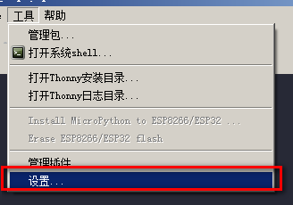
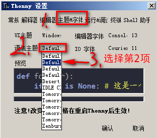
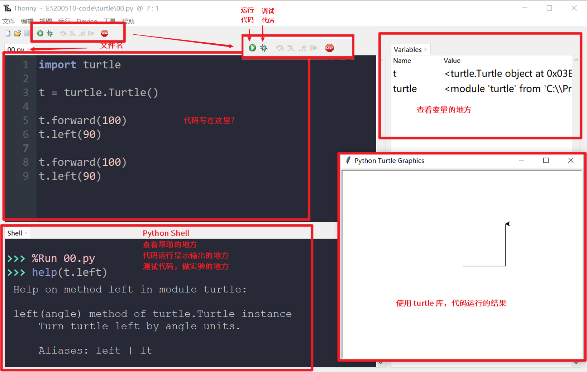
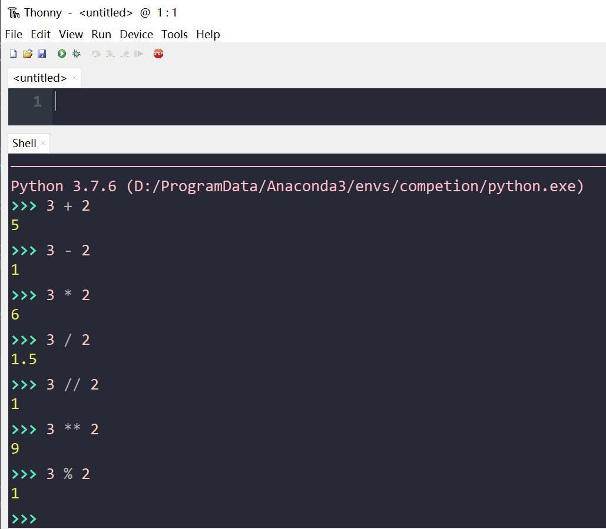
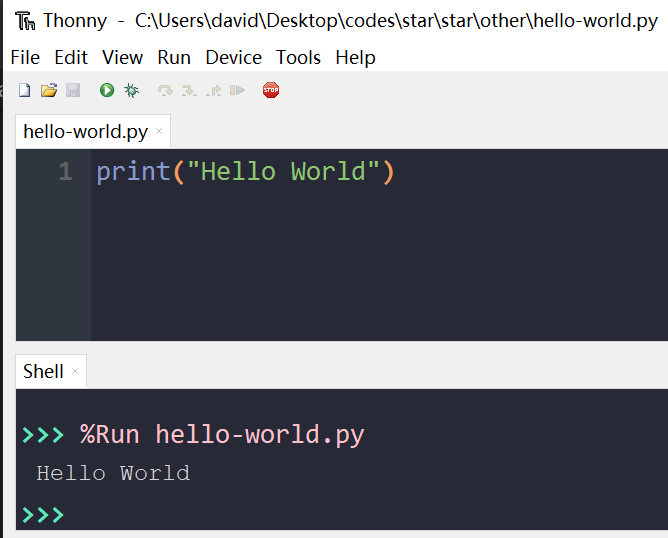

# 工作环境及 Hello World

## 工作环境

Python 的编程环境，有许多可供选择优秀的编辑器或者 IDE （集成化开发环境）。

下面列出的是其中部分：

* Thonny （对初始学者来说，是个不错的选择）
* Jupyter Notebook （易用，笔记 + 代码 ）
* PyCharm（比较流行，功能强大）
* VS Code （流行，微软出口，功能强大）


在我们的课程中在入门阶段，选择的是 Thonny 这个适于初学者的 IDE。

* 它内置了 Python 
    * 不需要额外安装，只要打开就可以直接学习 Python 编程。
* 查看变量非常方便
* 带有简易的调试器

### Thonny 设置与界面

Thonny 可根据自己喜好进行设置，下图为设置示例。

* 主题设置





* 操作界面 




### Python Shell

在 Thonny 的 Python Shell 中我们可以用它来当作计算器、测试代码、查看帮助等等。

* 当作计算器



* 测试代码及查看帮助

```python
>>> import random
>>> dir(random)   # 查看对象可用方法与属性
['BPF', 'LOG4', 'NV_MAGICCONST', 'RECIP_BPF', 'Random', 'SG_MAGICCONST', 'SystemRandom', 'TWOPI', '_BuiltinMethodType', '_MethodType', '_Sequence', '_Set', '__all__', '__builtins__', '__cached__', '__doc__', '__file__', '__loader__', '__name__', '__package__', '__spec__', '_acos', '_bisect', '_ceil', '_cos', '_e', '_exp', '_inst', '_itertools', '_log', '_os', '_pi', '_random', '_sha512', '_sin', '_sqrt', '_test', '_test_generator', '_urandom', '_warn', 'betavariate', 'choice', 'choices', 'expovariate', 'gammavariate', 'gauss', 'getrandbits', 'getstate', 'lognormvariate', 'normalvariate', 'paretovariate', 'randint', 'random', 'randrange', 'sample', 'seed', 'setstate', 'shuffle', 'triangular', 'uniform', 'vonmisesvariate', 'weibullvariate']
>>> help(random.randint)  # 查看对象帮助
Help on method randint in module random:

randint(a, b) method of random.Random instance
    Return random integer in range [a, b], including both end points.
>>> 
```


## Hello World

在学习一种程序语言的时候，通常会来写一个叫做 "Hello World" 的入门程序。

下面我们就来用 Python 来写一下这个小程序，你会发现难以致信的简单

操作步骤：

* 在 Thonny 中新建一文件
* 输入图中代码
* 保存为 `hello-world.py`
* 单击运行（或按 F5）来运行程序



### 任务一：熟悉 Thonny 操作界面

### 任务二：用 Thonny 做简单的练习

### 任务三：用 Thonny 做 `dir()` 及 `help()` 练习
