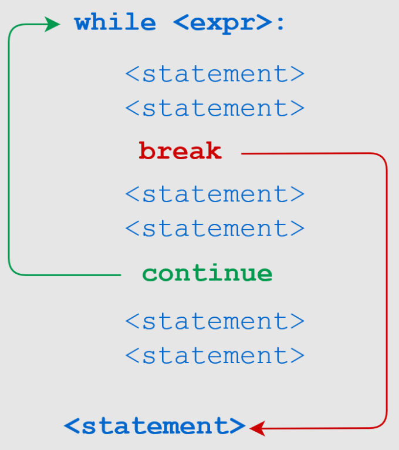

# Python 基础知识

## 使用变量

在编程中，肯定会与不同类型的数据打交道。虽然可以直接使用数据，但更多时候，将数据存在一个盒子（**变量**）里，以方便使用。


### 变量的赋值

将数据放入变量的过程，叫做 **赋值**。在 Python 中使用 `=` 做为 **赋值运算符**。

用法如下：

```
变量名 = 数据内容(值)
```

举例：

```python
age = 15         # age 变量，存储值为整数 15
price = 23.45    # price 变量，值为浮点数，23.45
name = '刘德华'   # name 变量，值为字符串，刘德华
flag = True      # flag 变量，值为布尔型，True
url = 'https://www.python.org/'  # url 变量，值为字符串，https://www.python.org/
```

### 变量名命名规则

* 变量名要尽量有意义，最好使用英文单词
* 变量名以字母或 `_` 开头，不能以数字开头
* 变量名只能包含 `A-Za-z0-9_` 字符，不能包含特殊字符，如 `$%#&@.-^` 等
* 变量名是大小写区分的，如 `age` 与 `Age` 是两个不同的变量
* 不能使用 Python 保留字用作变量名，如 `class`、`for`、`def`、`is`、`if` 等等.


### 变量的使用

变量一旦被定义好，就在后面的代码中使用了。

```python
name = 'David'
age = 15

print(f"{name} 的年龄为 {age}")
# David 的年龄为 15
```

## 循环

### for 循环（固定次数的循环）

Python for 循环可以遍历任何可迭代对象，如一个列表或者一个字符串。

#### 语法

```python
for <variable> in <sequence>:
    <statements>
else:
    <statements>
```

#### 举例

```python
nums = [13, 11, 8, 9, -5]
for n in nums:
    print(n)
# 13
# 11
# 8
# 9
# -5


fruits = ['apple', 'banana', 'pear', 'berry']
for fruit in fruits:
    print(fruit)
# apple
# banana
# pear
# berry    
```


#### `range()` 用法

`range()` 是 Python 内置的函数，它可以很方便地生成一个能够产生从开始到结束（不包括结束值）的对象。

* 语法

```python
# 从 0 到 stop 
range(stop) 

# 从 start 到 stop (不包括)，步长为 step（可选）
range(start, stop[, step]) 
```

* 举例

```python
# 0-4
for i in range(5):
    print(i)
# 0
# 1
# 2
# 3
# 4  

# 0-10 之间所有奇数
for i in range(1, 10, 2):
    print(i)
# 1
# 3
# 5
# 7
# 9
```


### while 循环（不定次数的循环）

对于不限定次数的循环，需要用到 `while` 语句

#### 语法

```python
while <expr>:
    <statement(s)>
```

#### 举例

```python

# 0-4
i = 0
while i < 5:
    print(i)
    i += 1
# 0
# 1
# 2
# 3
# 4  

# 0-10 之间所有奇数
i = 1
while i < 10:
    print(i)
    i += 2
# 1
# 3
# 5
# 7
# 9
```


#### 无限循环

在循环时，有时需要用到无限循环，它其实也是 `while` 循环的一种。

* 举例

```python
while True:
    print("Hello Python.")
```

如果执行上述代码，程序就会一直在 Shell 中打印 `Hello Python.` 。
此时，可以按 **Ctrl + C** 来中止程序的执行。


### `break` 与 `continue`

* `break`：立即中止循环的执行，转而执行循环后面的语句
* `continue`：停止当前这一次循环的执行，转而执行下一次循环的执行

可以参照下图进行理解




## 判断

在 Python 中使用 `if-else` 来进行条件的判断。

### 单个分支

#### 语法

```python
if <expr>:
    <statement>
```

* `<expr>`：是一个表达式，结果为布尔值，即 `True` 或 `False`
* `<statement>`：是有效的 Python 语句，可以有一条或多条，但至少要有一条
* 如果 `<expr>` 为 `True`，则 `<statement>` 会被执行；如果为 `False`，则 `<statement>` 不会被执行

> [!TIP]
> * `<expr>` 后面的 `:` 是必须的
> * `<statement>`：必须要缩进，否则会抛出 `IndentationError` 错误

#### 举例

```python
# 如果 a > b，输出 yes
a, b = 5, 3
if a > b:
    print("大于")

if a < b:
    print("小于")
# 大于 
```

### 两个分支

#### 语法

```python
if <expr>:
    <statement(s)>
else:
    <statement(s)>
```

* 如果 `<expr>` 为 `True`，则 `if` 后面的语句会被执行，`else` 后面语句会被忽略；
* 如果 `<expr>` 为 `False`，则 `else` 后面的语句会被执行，`if` 后面语句会被忽略；


#### 举例

```python
x = 85

if x < 60:
    print(f"分数为：{x}")
    print("不及格")
else:
    print(f"分数为：{x}")
    print("及格") 
# 分数为：85
# 及格
```


### 多个分支

#### 语法

对于多个条件可以使用 `elif` 来实现多分支判断。


```python
if <expr>:
    <statement(s)>
elif <expr>:
    <statement(s)>
elif <expr>:
    <statement(s)>
    ...
else:
    <statement(s)>
```

* 可以有任意多个 `elif` 语句
* `else` 语句是可选的，可以不出现，但如果出现一定是在最后


#### 举例

```python
x = 85

if x < 60:
    print("不及格")
elif 60 < x < 79:
    print("及格") 
elif 80 < x < 89:
    print("良好") 
elif 90 < x <= 100:
    print("优秀") 
else:
    print("成绩有误，请重试")
# 良好 
```


### 条件表达式

在 Python 中还支持一种叫做 **条件表达式** 的特殊的判断。

#### 语法

```python
<expr1> if <conditional_expr> else <expr2>
```

* `<conditional_expr>` 会先被执行
* 执行的结果，若为 `True`，表达式结果为 `<expr1>`，若为 `False`，表达式结果为 `<expr2>`

#### 举例

```python
age = 19
s = "未成年" if age < 18 else "成年"
print(s)
# 成年
```


