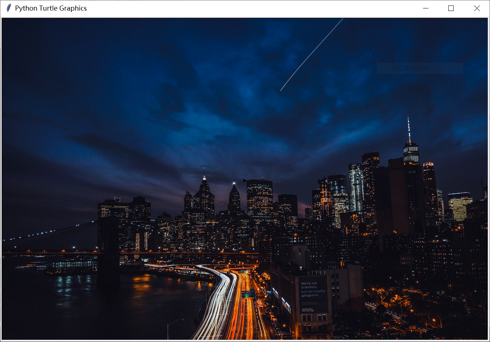

# 设置窗口背景及绘制第一颗星 

## 学了本课，可以掌握 

* 给窗口设置背景
* 在窗口中绘制一颗五角星

## 知识回顾

%accordion%导入及创建海龟实例%accordion%
```
import turtle
t = turtle.Turtle()
``` 
%/accordion%

%accordion%设置颜色%accordion%
```
t.color("yellow")  # 设置颜色
``` 
%/accordion%


%accordion%填充图形%accordion%
```
t.begin_fill()   # 开始填充
# 绘制的封闭图形
t.end_fill()     # 填充结束
``` 
%/accordion%


%accordion%参考代码%accordion%

复制下面代码到 Thonny 中，保存为 01.py，执行

```python
import turtle

t = turtle.Turtle()  # 创建海龟实例

t.color("yellow")  # 设置颜色

t.begin_fill()   # 开始填充
for i in range(5):
    t.forward(30)
    t.left(144)   # 五角星转动角度
t.end_fill()     # 填充结束

```
%/accordion%

执行结果如下图：


## 新知识

能不能给窗口设置一个背景颜色，或用图片当作背景呢？


答案是肯定的，这里需要先创建一个 `turtle.Screen` 类的实例，并使用它的 `.bgcolor` 或 `.bgpic` 方法，具体用法如下：

### 设置背景颜色

#### 任务一：给窗口设置一个背景色


```python
import turtle

t = turtle.Turtle()    # 创建海龟实例
wn = turtle.Screen()   # 创建窗口实例

wn.bgcolor("gray")  # 使用颜色名称，gray，设置背景色为灰色
# wn.bgcolor(255, 0, 0)  # 使用三个数字（0~255），设置背景色为红色
```

> [!TIP]
> * 如果使用数字来设置背景颜色，需要注意颜色模式的设置
>   * `turtle.colormode(255)`，数字范围为 `0~255`
>   * `turtle.colormode(1)`，数字范围为 `0~1`


### 设置背景图片

要想将下面这张图片设置为窗口的背景


#### 任务二：设置窗口的背景

```python
import turtle

t = turtle.Turtle()    # 创建海龟实例
wn = turtle.Screen()   # 创建窗口实例

width = 1336
height = 889

wn.setup(width, height)     # 设置窗口大小
wn.bgpic("city-night.gif")  # 设置背景图片
```

> [!TIP]
> * 上面代码中先设置了窗口的大小，目的是让图片充满整个窗口，这是可选的。
> * 背景图片一定要 `.gif` 格式的。
> * 背景图片要与脚本放在相同的文件夹内，否则要指明图片的具体路径。


完成效果如下：



#### 任务三 ：绘制一颗五角星

在任务二的基础上，绘制一颗五角星

* 填充色为黄色
* 五角星边长为 35


