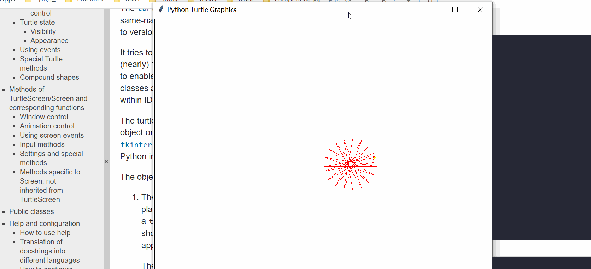

# turtle 基础知识

## turtle 简介

想你一下，你可以通过简单的指令，在屏幕上按照你的想法去移动，甚至绘制各种图形，是不是很 Cool？

而这就是 `turtle` 要做的事，turtle 是 Python 的一个内置库，它主要的作用是帮助儿童或编程初学者理解编程的基本概念。它的特点是 **简单明了** 且 **用途广泛**。


看一个官方所给的示例代码，通过将简单的动作重复就可以得到一个复杂的图形。

运行效果如下：



代码如下：

```python
import turtle

t = turtle.Turtle()
t.speed(0)

t.color('red', 'yellow')
t.begin_fill()
while True:
    print(t.pos())
    t.forward(150)
    t.left(190)
    
    if abs(t.pos()) < 1:
        break

t.end_fill()

```


## turtle 开始使用

### 导入及实例化

要使用 turtle ，则需要先将 turtle 导入，再对 `Turtle` 实例化。

```python
import turtle

t = turtle.Turtle()
```

### 基础用法

这里的 `t` ，可以将它想像为一支 **笔**，它可以在画布上运动，也可以设置特定的属性。

* 它可以在 **画布** 上移动
    * `t.forward(100)`：在当前方向上向前移动 100 个单位
    * `t.backard(50)`：在当前方向上向后移动 50 个单位
* 可以转动方向
    * `t.left(90)`： 向左转 90 度
    * `t.right(30)`： 向右转 30 度
* 可以跳转到给定坐标处
    * `t.goto(100, 200)`：跳转到坐标 (100, 200) 位置 
* 回到出生原点
    * `t.home()`：回到原点
* 画笔可以抬起来，也可以放下去
    * `t.penup()`：抬起画笔，不会在屏幕上留下痕迹   
    * `t.pendown()`：放下画笔，会在屏幕上留下痕迹   
* 它可以有自己的颜色（颜色名称，或 RGB 对应数字） 
    * `t.color("red")`
    * `t.color("red", "yellow")`
    * `t.color(255, 0, 0)`
* 可以设置速度（0~10，或速度字符串）
    * `t.speed(1)` 或 `t.speed("slowest")`
    * `t.speed(3)` 或 `t.speed("slow")`
    * `t.speed(6)` 或 `t.speed("normal")`
    * `t.speed(10)` 或 `t.speed("fast")`
    * `t.speed(0)` 或 `t.speed("fastest")`
* 可以设置粗细（正的数字）
    * `t.pensize(1)`    
    * `t.pensize(20)`
* 可以显示或隐藏
    * `t.hideturtle()`：隐藏
    * `t.showturtle()`：显示    


### 练习一：绘制一个边长为 100 的正方形

%accordion%参考代码%accordion%
```python
import turtle

t = turtle.Turtle()
side = 100

t.forward(side)
t.left(90)
t.forward(side)
t.left(90)
t.forward(side)
t.left(90)
t.forward(side)
t.left(90)
``` 
%/accordion%

### 更多方法 


* 绘制预设形状
    * 绘制圆形
        * `t.circle(50)`：绘制半径为 50 的圆
    * 绘制点
        * `t.dot(30)`：绘制直径为 30 的点
        * `t.dot(50, "red")`：绘制直径为 50，颜色为红色的点
* 改变屏幕背景
    * 默认情况为白色背景
    * 修改背景色
        * 修改为黑色
        * `turtle.bgcolor("black)`
            * 需要注意的是，不能写为 `t.bgcolor("black")` 
            * 因为背景是整体的，而 `t` 只是这个平台下面的
* 改变 turtle 形状
    * turtle 默认形状为箭头
    * 可以使用 `shape()` 函数改变形状
        * 可用参数：'arrow', 'turtle', 'circle', 'square', 'triangle', 'classic'
        * `t.shape("arrow")` 设置 `t` 的形状为 arrow
        * `t.shape("turtle")` 设置 `t` 的形状为 turtle 
        * `t.shape("circle")` 设置 `t` 的形状为 circle 
* 填充图形
    * turtle 库允许对封闭图形填充颜色
    * 示例代码见下方


```python
# 填充代码示例

t.color('red', 'yellow')  # 画笔颜色为 red，填充色为 yellow
t.begin_fill()            # 开始填充
for i in range(3):
    t.forward(100)
    t.left(60)
t.end_fill()              # 结束填充
```    
    


