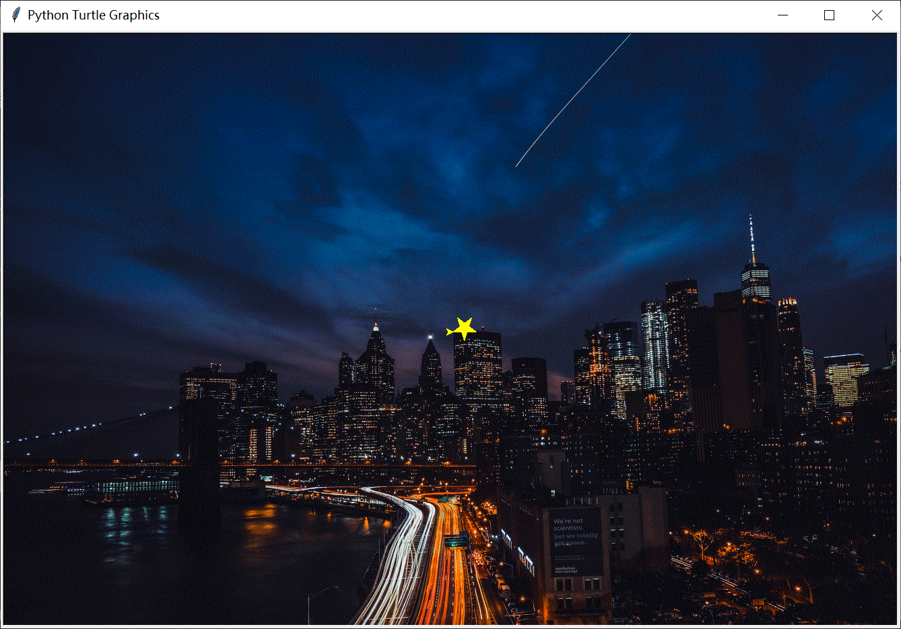

# 用“函数”绘制夜空中最亮的星


## 学习目标 

* 定义绘制五角星的函数
* 调用函数绘制五角星
* 设置函数的参数


## 任务一：绘制第二颗星

### 知识回顾

上次课我们主要学习了：

* 给窗口设置背景
* 用 turtle 绘制五角星

复制下面代码，保存为 *01.py*，运行后可以看到如下效果。



%accordion%参考代码%accordion%
```python
import turtle

t = turtle.Turtle()    # 创建海龟实例
wn = turtle.Screen()   # 创建窗口实例

width = 1336
height = 889

wn.setup(width, height)     # 设置窗口大小
wn.bgpic("city-night.gif")  # 设置背景图片

t.color("yellow")

t.begin_fill()   # 开始填充
for i in range(5):
    t.forward(35)  # 五角星的边长
    t.left(144)   # 五角星转动角度
t.end_fill()     # 填充结束
``` 
%/accordion%


### 任务要求

* 先移动到坐标 (200, 200) 处
* 再绘制相同大小的一颗五角星
* 文件名保存为 *star02.py*

%accordion%请思考移到指定坐标，需要哪些步骤？%accordion%
```python
t.penup()
t.goto(200, 200)
t.pendown()
```
%/accordion%


## 任务二：用函数绘制五角星

### 思考：你会怎么做？

如果绘制五角星的代码，要在程序的多个地方使用，你会怎么做呢？


#### DRY 原则

Don't Repeat Yourself (DRY) 是软件开发的一项原则，其主要目标是避免代码重复。

> “系统内的每条知识都必须有一个单一的、明确的、权威的表示” —— Andrew Hunt 和 David Thomas：《务实的程序员：从熟练工到大师》

#### 了解函数

在编程中，**函数 (function)** 是将完成一项或多项特定任务代码封装起来的的代码块。

在前面的课程中，我们已经学习过一些 Python 内置的函数。

### 测一测：常用内置函数

[常用内置函数](exam/builtins.html)


### 函数的定义

在 Python 中，定义函数的语法如下：

```python
def 函数名([参数列表]):
    函数体
```

定义函数的几个组成部分，解释如下：

|组成|含义|
|----|----|
|`def`|告诉 Python 我们要开始定义一个函数了|
|函数名|有效的 Python 标识符|
|参数列表|供函数使用的数据：可以有，也可以没有<br />如果有多个，用 `,` 分隔|
|`:`|表示函数头（函数名与参数列表）的结束|
|函数体|实现函数功能的一条或多条语句|

> [!TIP|style:flat]
> **函数体** 中的语句相对 **函数头** 部分，与前面学习过的 `for` 循环与 `if` 语句一样，一定要 **缩进**
> 向右缩进：按 `Tab` 键；向左缩进：按 `Shift + Tab` 键


### 测一测：定义函数

[定义函数](exam/define.html)

**判断正误** : 下面函数定义的是否正确？

```python
# 函数定义 1
de hello():
print("函数你好")


# 函数定义 2
def hello()
    print("函数你好")

# 函数定义 3
def 2hello():
    print("函数你好")
    

# 函数定义 4 
def hello(）:
    print("函数很好")
    print("函数很强大")

# 函数定义 5 
def hello():
    print("函数很好")
    print("函数很强大")
```

### 调用函数

调用函数的语法很简单：

```python
函数名([参数列表])
```

只要在需要完成该功能的位置，输入函数名及对应的参数（如果有的话）。如调用上述的 `hello` 函数的方法：

```python
hello()
```


### 任务要求

将前面练习一中代码另存为 *fun01.py* ，通过定义函数来绘制五角星。


## 任务三：绘制 30 颗随机位置的五角星

### 带参数的函数

在前面绘制五角星时，我们定义的函数是不带参数。而更多时候，我们希望将不同的数据传递到函数里面，这样才会让函数可以适应更多的变化。

通常有以下三种类型的参数：

* 位置参数
* 关键字参数
* 默认参数


#### 位置参数

将参数传递给函数最方便的方法是使用 **位置参数（也叫必须参数）**，在函数定义时，在括号内指定 **逗号** 分隔的参数列表：

```python
def 函数名(参数1, 参数2, ...):
    函数体
```

如定义一个简单的 `hello()` 函数如下：

```python
def hello(name, city):
    print(f"来自 {city} 的 {name}，你好啊！")
```

当函数被调用时，根据参数列表提供 **按顺序** 对应的数据即可。

```python
# 直接传入数据
hello("张三", "宁波")
# 来自 宁波 的 张三，你好啊！


# 或者传入变量
name = "张三"
city = "宁波"
hello("张三", "宁波")
# 来自 宁波 的 张三，你好啊！
```

> [!TIP|style:flat]
> 位置参数列表，一定要按顺序对应，不能随意改变参数位置
> 位置参数，不能多也不能少


### 拆解问题

前面绘制的第二颗五角星，是指定坐标的。而现在需要绘制随机位置的 30 颗五角星，那就意味着需要 30 个随机的 `x` 与 `y` 值。

那问题就可以拆解为下面步骤：

* 要画 30 颗星，肯定要用到循环
* 定义带参数的绘制五角星函数
* 产生随机的 x 与 y
* 调用函数完成绘制

### 回顾随机数方法

请先回忆前面所学，如何生成一个指定范围随机数的方法。

如果回忆不起来，可以查看参考代码。

%accordion%参考代码%accordion%

```python
# 要产生随机数，首先需要导入 random
import random

# 生成 [0, 100] 之间的随机整数，并赋给变量 x
x = random.randint(0, 100)
print(x)
# 31
```

> [!TIP|style:flat]
> 导入的语句 `import random`，要放在整个代码的最前面，可以放在 `import turtle` 的后面一行

%/accordion%

### 星星的位置


%accordion%星星的位置%accordion%


%/accordion%


### 完成绘制 30 颗随机位置的五角星


## 总结与拓展任务

### 总结与回顾

通过本节课的学习，主要学习了：


### 拓展任务

> 定义绘制五角星函数，可以传入大小、颜色等。


